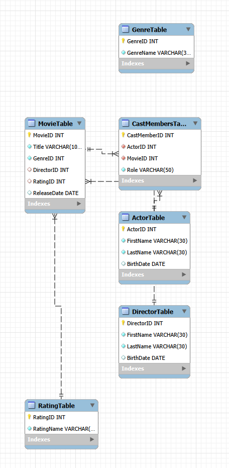

# DDL Activity

## EER DIAGRAM:



## Instructions
The database should keep track of movies we are interested in. Create a .sql script file to create a database named MovieCatalogue that contains the following tables:

### Movie Table
- MovieID - Primary key, Identity
- GenreID - Foreign key, Genre table, Required
- DirectorID - Foreign key, Director table, Not required
- RatingID - Foreign key, Rating table, Not required
- Title - Required, Extended character set, Length: 128
- ReleaseDate - Not required
### Genre Table
- GenreID - Primary key, Identity
- GenreName - Required, Extended character set, Length: 30
### Director Table
- DirectorID - Primary key, Identity
- FirstName - Required, Extended character set, Length: 30
- LastName - Required, Extended character set, Length: 30
- BirthDate - Not required
### Rating Table
- RatingID - Primary key, Identity
- RatingName - Required, Standard character set, Length: 5
### Actor Table
- ActorID - Primary key, Identity
- FirstName - Required, Extended character set, Length: 30
- LastName - Required, Extended character set, Length: 30
- BirthDate - Not required
### CastMembers Table
- CastMemberID - Primary key, Identity
- ActorID - Foreign key, Actor table, Required
- MovieID - Foreign key, Movie table, Required
- Role - Required, Extended character set, Length: 50

# `test.sql` Overview

- Create the DB if it doesn't exist
```
create database if not exists leocosta_orderbook_test;
```

- Specify the DB to use for subsequent SQL
```
use leocosta_orderbook_test;
```

- Delete tables if needed, since there is a foreign key in orders from users, we must delete orders first. These lines are currently commented out
```
-- drop table if exists orders;
-- drop table if exists users;
-- drop table if exists global_counters;
```

- If global counters table does not exist, create it, declare id as a primary key with tinyint type, and user_id & order_id counters with bigint type
```
create table if not exists global_counters (
	id tinyint primary key,
    user_id_counter bigint,
    order_id_counter bigint
);
```

- Insert default values for global_counters table if they don't exist (ignore statement is what does not set the values if they exist)
```
insert ignore into global_counters (id, user_id_counter, order_id_counter) values (1, 0, 0);
```

- Create the users table if it doesn't exist, user_id is a bigint type
```
create table if not exists users (
	user_id bigint primary key
);
```

- Create an update statement with subsequent logic (note the semicolon does not end until the third line for atomicity) Increment user_id_counter by 1 and create a variable called `@next_user_id` to reference it
```
update global_counters
set user_id_counter = last_insert_id(user_id_counter + 1)
where id = 1;
set @next_user_id := last_insert_id();
```

- This is a mock creation of a new user with the `@next_user_id` variable
```
insert into users values (@next_user_id);
```

- Repeat the same logic as the last two steps to create a second user
```
update global_counters
set user_id_counter = last_insert_id(user_id_counter + 1)
where id = 1;
set @next_user_id := last_insert_id();

insert into users values (@next_user_id);
```

- Create table for orders if it does not exist, order_id & user_id are bigint types.
- Constraint `fk_user_id` defined to reference user_id value in users table
- `on update cascade` updates the user_id in this entry if its updated in the users table
- `on delete restrict` prevents the user_id from being deleted in the users table if being used in the orders table
```
create table if not exists orders (
	order_id bigint primary key not null,
	user_id bigint not null,
    constraint fk_user_id
		foreign key (user_id) references users(user_id)
        on update cascade
        on delete restrict
);
```

- State global_counters is being updated, increment the order_id_counter and create a variable `@next_order_id` with the incremented counter value. Insert the order ID wi
```
update global_counters
set order_id_counter = last_insert_id(order_id_counter + 1)
where id = 1;
set @next_order_id := last_insert_id();
```
- Atomic insert, we state the table we'll be inserting into and what keys
- We state the values to insert respectively

```
insert into orders (order_id, user_id)
select @next_order_id, 3
```

- We fetch order ids & user ids from the orders table
```
select order_id, user_id from orders;
```

